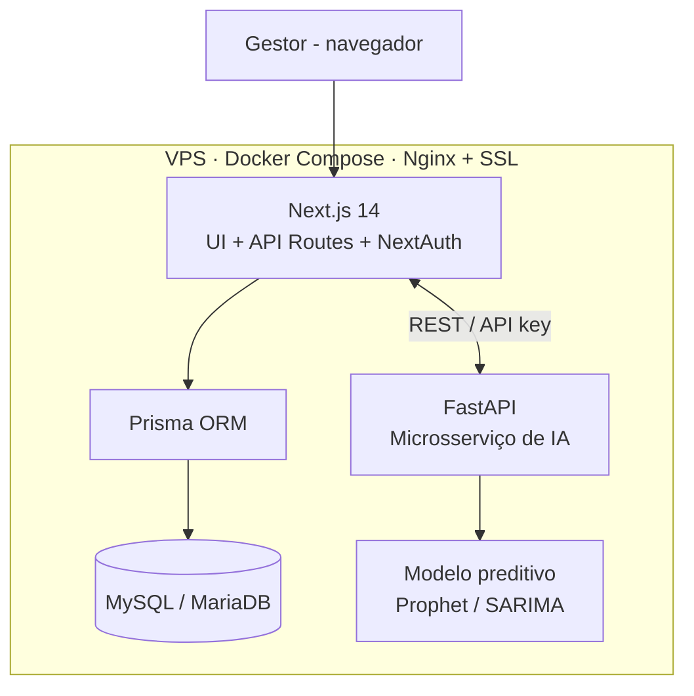

<div align="center">
  

  # 🍕 Fredda Pizzaria

  **Sistema de gestão de produção e estoque para pizzaria de massas de longa fermentação**

  Portfólio de Engenharia de Software · Católica SC · 2026
  Autor: **Diego Planinscheck**

  `Next.js 14` · `TypeScript` · `Prisma` · `MySQL` · `NextAuth.js` · `Python/FastAPI` · `Docker`
</div>

---

## 📌 Sobre o projeto

O **Fredda Pizzaria** é um sistema web que integra **controle de estoque**, **acompanhamento do processo produtivo com rastreamento de fermentação** e **previsão de demanda com inteligência artificial**, voltado a pizzarias artesanais que trabalham com massas congeladas de longa fermentação (24–72 h).

O projeto nasce de um problema real, identificado em parceria com um negócio local — o que garante validação contínua dos requisitos com o gestor.

## ❗ Problema e necessidade de mercado

Pizzarias de massa de longa fermentação enfrentam desafios que os sistemas genéricos não resolvem:

- Gestão manual (planilhas) de insumos perecíveis → **desperdício**.
- Falta de **rastreabilidade** dos lotes produzidos.
- Ausência de **controle de tempo e temperatura** das etapas de fermentação.
- Nenhuma previsão de demanda ajustada à **sazonalidade** do pequeno negócio.

Em uma análise de **3 artigos científicos** e **3 softwares de mercado**, dois requisitos centrais ficaram **totalmente descobertos**: o **monitoramento da fermentação** e o **uso de IA preditiva** — a lacuna de inovação deste projeto.

## 💡 Solução e módulos

| Módulo | Descrição |
|---|---|
| 📦 **Estoque de insumos** *(MVP)* | Cadastro de insumos, fornecedores e categorias; entradas e saídas; lotes e validade; alertas de estoque mínimo; histórico auditável. |
| ⏱️ **Produção & fermentação** | Ordens de produção; timer por etapa (24–72 h); registro de temperatura e condições; painel de status em tempo real. |
| 🏪 **Vendas & demanda** | Registro de vendas por canal (balcão, delivery, atacado), formando o histórico que alimenta a IA. |
| 🧠 **Inteligência artificial** | Sugestão de produção semanal por produto, com intervalo de confiança e comparação planejado × realizado. |

## ✨ Inovação

- **Rastreamento temporal da fermentação** como entidade de primeira classe: tempo + temperatura por etapa, vinculados ao lote.
- **Previsão de demanda dirigida por dados**: o histórico de vendas vira recomendação operacional acionável.

## 🏗️ Arquitetura

Aplicação web *fullstack* modular + microsserviço de IA desacoplado, conteinerizados em VPS.



**Fluxo central:** entrada de insumo → ordem de produção (consome estoque pela ficha técnica) → etapas de fermentação (tempo + temperatura por lote) → produto final → venda. O histórico de vendas realimenta a IA, que devolve sugestões ao planejamento.

## 🧰 Stack tecnológica

- **Frontend/Backend:** Next.js 14 (App Router), TypeScript, Tailwind CSS
- **ORM/Banco:** Prisma + MySQL/MariaDB
- **Autenticação:** NextAuth.js (Credentials, JWT)
- **IA:** Python + FastAPI (modelos de série temporal: Prophet / SARIMA / XGBoost)
- **Infra:** Docker + Docker Compose, VPS, Nginx, SSL (Let's Encrypt), CI/CD com GitHub Actions

## 🚀 Como rodar localmente

> Pré-requisitos: Node.js 18+, Docker e Docker Compose.

```bash
# 1. Clonar o repositório
git clone https://github.com/<seu-usuario>/fredda-pizzaria.git
cd fredda-pizzaria

# 2. Variáveis de ambiente
cp .env.example .env
# edite .env com as credenciais do banco e o NEXTAUTH_SECRET

# 3. Subir os serviços (app + banco)
docker compose up -d

# 4. Rodar as migrations do Prisma
npx prisma migrate dev

# 5. Acessar
# http://localhost:3000
```

## 📂 Estrutura do projeto

```
fredda-pizzaria/
├── app/            # Rotas e páginas (Next.js App Router)
├── components/     # Componentes de UI
├── lib/            # Utilitários e configuração (auth, prisma client)
├── prisma/         # schema.prisma e migrations
├── ai-service/     # Microsserviço Python/FastAPI (previsão de demanda)
├── docker-compose.yml
└── README.md
```

## 🗓️ Roadmap (sprints)

Desenvolvimento em **Scrum** (sprints quinzenais), gerenciado no **Jira** (5 épicos, 26 issues):

- **EP-01 — Fundação:** repositório, Next.js, Prisma, autenticação, base de deploy
- **EP-02 — Estoque (MVP):** CRUD de insumos, entradas/saídas, alertas, histórico
- **EP-03 — Produção:** ordens, fermentação com timer, temperatura, painel
- **EP-04 — IA/Demanda:** vendas, microsserviço FastAPI, sugestão semanal
- **EP-05 — DevOps:** Docker, CI/CD, VPS, domínio e SSL

## 📈 Resultados esperados

Redução de desperdício · rastreabilidade completa de lotes · planejamento de produção qualificado pela IA · dashboard com KPIs operacionais em tempo real.

## 📄 Documentação

O artigo científico completo do portfólio está em [`docs/`](docs/).

## 👤 Autor

**Diego Planinscheck** — Engenharia de Software, Católica SC
✉️ diego.planinscheck@catolicasc.edu.br

---

<div align="center">
  <sub>Projeto acadêmico desenvolvido em parceria com um negócio local real.</sub>
</div>
